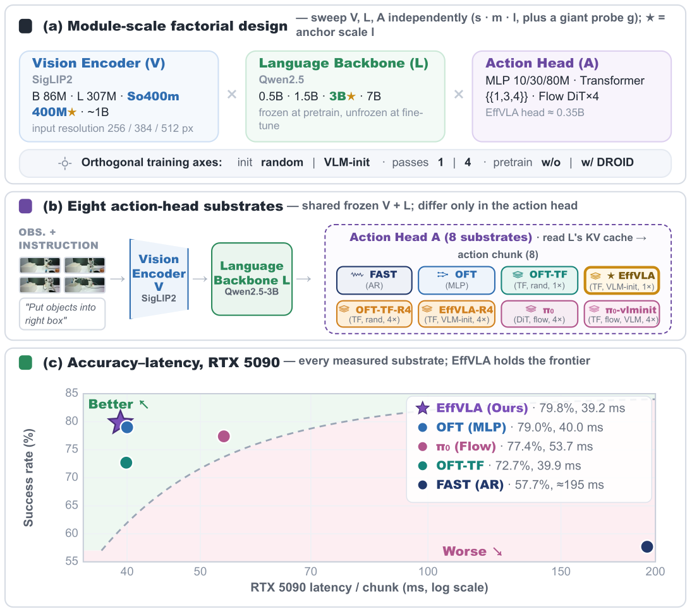
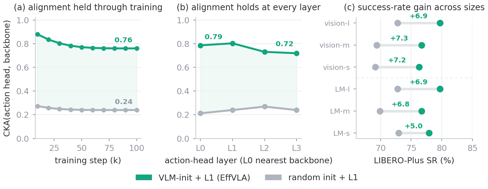
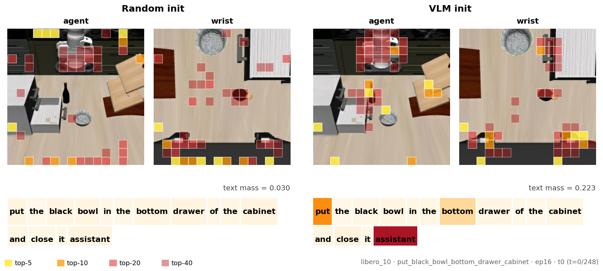
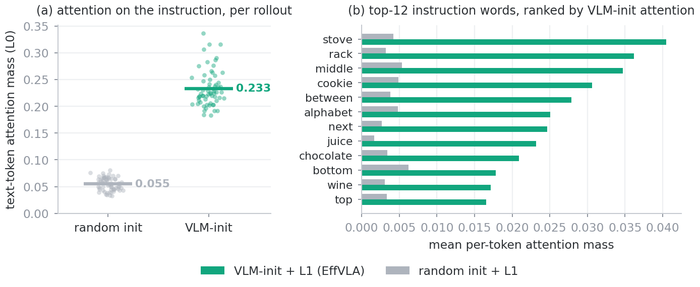
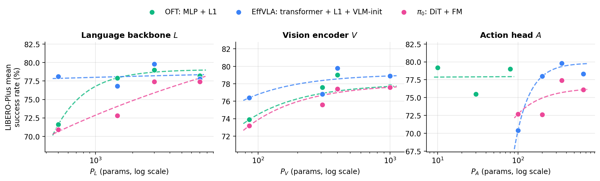

<div align="center">

# What Makes an Efficient VLA? Navigating Action-Head Design, Scaling, and Latency

Luoyang Sun<sup>1,2,3,4</sup>, Guoyang Xia<sup>5,4</sup>, Fengfa Li<sup>4</sup>, Lei Ren<sup>4</sup>, Xinyu Cui<sup>1,2</sup>, Haifeng Zhang<sup>1</sup>, Fangxiang Feng<sup>5</sup>,<br>Kaike Zhang<sup>4</sup>, Kun Zhan<sup>4</sup>, Yan Xie<sup>4</sup>, Jun Wang<sup>6</sup>, Cheng Deng<sup>7</sup>

<sub><sup>1</sup>Institute of Automation, CAS · <sup>2</sup>UCAS · <sup>3</sup>AI Lab, The Yangtze River Delta · <sup>4</sup>Li Auto · <sup>5</sup>BUPT · <sup>6</sup>UCL · <sup>7</sup>Edinburgh</sub>

<br>

[](#) &nbsp;[](#) &nbsp;[](https://mindvla-team.github.io/EFFVLA/) &nbsp;[](https://github.com/MindVLA-Team/EFFVLA)

</div>

> **What decides a modular VLA's action head is not its decoder, loss, or inference budget, but how it is initialized.** Copying the backbone's last transformer layers into the head is the largest lever we measure; _representation alignment_ is the account we offer for why it works.
> This repository releases the action-head modeling code — two models, **`EffVLA`** and **`Pi0`** — as drop-in modules for the [starVLA](https://github.com/MindVLA-Team) framework.

<p align="center">
  
</p>

 &nbsp;**THE&nbsp;MEASUREMENT**
## Three findings

Holding the vision encoder, language backbone, data, and benchmark fixed, and varying only the action head one axis at a time — every configuration timed on the same hardware — one axis dominates the rest, and it is not an architectural one: **how the head is initialized**.

| | Finding | Result |
|:--:|:--|:--:|
| **1** | **Align the head, then keep it simple.** VLM-initializing the head is the largest lever, at no latency cost; once aligned, flow matching and extra passes stop paying. | **+7.1** pts |
| **2** | **Capacity pays only after alignment.** The aligned action head is the highest-return module to scale — far above the vision encoder or language backbone. | **~4** pts / ms |
| **3** | **Stop at a modest size.** Returns saturate early, near the budget today's π-series VLAs already use. | **~3.75B** |

 &nbsp;**WHY&nbsp;IT&nbsp;WORKS**
## The alignment mechanism

Alignment is directly measurable, and it is what the initialized head retains. It holds a linear CKA of **0.76** with the backbone throughout fine-tuning while a random head never rises above **0.24**, at every layer, and the gap tracks the accuracy gain across all backbone sizes.

<p align="center">
  
</p>

It also shows up in behaviour. Told to *"put the black bowl in the bottom drawer of the cabinet,"* the aligned head concentrates on the instruction and the named object; the random head is diffuse and leaves the instruction almost unattended (text mass **0.223** vs **0.030**). Across all 128 rollouts the aligned head attends ~**4×** more to the instruction, focusing on the nouns that name the task.

<p align="center">
  
  <br><br>
  
</p>

Because we reach that state only through initialization, we present representation alignment as the reading that best organizes these measurements rather than as a demonstrated cause; the paper names the control that would settle it.

 &nbsp;**THEN&nbsp;CAPACITY**
## Where to scale

Capacity pays only after alignment: under the aligned head, scaling the action head turns capacity into accuracy while the vision encoder and language backbone saturate — and even the action head saturates past a modest size.

<p align="center">
  
</p>

 &nbsp;**BENCHMARKS**
## Results

Standard LIBERO by the four task suites (left of **Avg**) and LIBERO-Plus by the seven zero-shot perturbation axes (right). **Bold** = column best, <u>underline</u> = second best.

| Method | Spatial | Object | Goal | Long | Avg | BG | Init | Cam | Lang | Noise | Layout | Light |
|:--|:--:|:--:|:--:|:--:|:--:|:--:|:--:|:--:|:--:|:--:|:--:|:--:|
| OpenVLA | 84.7 | 88.4 | 79.2 | 53.7 | 76.5 | 34.8 | 3.5 | 0.8 | 23.0 | 15.2 | 28.5 | 8.1 |
| π₀ | 98.0 | 96.8 | 94.4 | 88.4 | 94.4 | 81.4 | 6.0 | 13.8 | 58.8 | <u>79.0</u> | 68.9 | 85.0 |
| π₀-FAST | 96.4 | 96.8 | 88.6 | 60.2 | 85.5 | 73.2 | 21.6 | <u>65.1</u> | 61.0 | 74.4 | 68.8 | 73.2 |
| RIPT-VLA | <u>98.6</u> | 98.6 | **99.0** | 93.8 | 97.5 | 91.6 | 31.2 | 55.2 | 77.6 | 73.5 | 74.2 | 88.4 |
| OpenVLA-OFT | 97.6 | 98.4 | <u>97.9</u> | 94.5 | 97.1 | <u>93.3</u> | 31.9 | 56.4 | 79.5 | 75.8 | 74.2 | 88.7 |
| ABot-M0 | **98.8** | **99.8** | **99.0** | **96.6** | **98.6** | 91.6 | <u>67.9</u> | 60.4 | <u>86.4</u> | **86.4** | <u>82.6</u> | <u>96.2</u> |
| **EffVLA (ours)** | <u>98.6</u> | <u>99.2</u> | **99.0** | <u>96.0</u> | <u>98.2</u> | **96.7** | **69.8** | **68.3** | **87.5** | 66.1 | **84.8** | **97.4** |

Success rate (%). Baselines other than EffVLA are as reported by prior work; EffVLA is the only row we evaluate ourselves, under the same protocol. EffVLA sits inside the saturated LIBERO band and **leads on six of the seven LIBERO-Plus perturbation axes**, with its widest margins on the spatial and language axes an aligned head is built to help. The [project page](https://mindvla-team.github.io/EFFVLA/) has the full 63-cell grid.

 &nbsp;**BEYOND&nbsp;THE&nbsp;GRID**
## Does the effect hold up?

Three checks, none of which extends the claim. Two ask whether the result the paper rests on is specific to the configuration we swept; the third asks how much of it is training noise.

**It holds in every matched pair.** Ten pairs of cells differ *only* in how the action head was initialized, holding decoder, parameter count, latency, module scales and inference budget fixed. All ten favour VLM-init, by **+5.8** points on average, across eight module-scale configurations, both inference budgets, and two benchmarks.

**It reproduces on another embodiment.** On SimplerEnv (WidowX) the same contrast is **+7.3** points against +7.1 on LIBERO-Plus, and there the random-init head is *architecture-matched*: the same Qwen decoder layers are deep-copied and then re-drawn, so topology, parameter count and latency are identical and only the weight values differ. The gain lives in the weights, not the architecture.

| Substrate | Stack | Carrot | Spoon | Eggplant | Overall |
|:--|:--:|:--:|:--:|:--:|:--:|
| OFT (MLP) | 50.0 | 37.5 | 50.0 | **100.0** | 59.4 |
| Transformer block, random init | 8.3 | **58.3** | **79.2** | 70.8 | 54.2 |
| π₀ (flow matching) | 43.6 | 36.6 | 67.9 | 93.8 | 60.5 |
| **EffVLA** (transformer, VLM-init) | 37.5 | 50.0 | 75.0 | 83.3 | **61.5** |

SimplerEnv on a WidowX arm; 24 trials per task, 96 per model. The three strongest substrates again fall within a few points of each other and OFT and π₀ swap order between benchmarks, so we read them as tied here too. At 96 trials the standard error on a difference is about 7 points, so this is a replication of the effect size and the ordering, not an independent significance test.

**We measured the training noise.** The sweep trains one seed per cell, so the `l/l/l` anchor pair was re-trained from scratch under five seeds. Run-to-run variation is **1.2** points (SD) for the initialized head and **1.5** for the MLP head — larger than the ~1-point evaluation-noise floor used elsewhere, so single-cell gaps of a point or two should be read as suggestive rather than decisive. EffVLA leads OFT in all five seeds, by +0.5 to +1.7 points (mean **+1.1**).

| Seed | EffVLA | OFT | Δ |
|:--:|:--:|:--:|:--:|
| 1 | 79.8 | 79.0 | +0.8 |
| 2 | 77.2 | 75.5 | +1.7 |
| 3 | 78.5 | 77.2 | +1.3 |
| 4 | 80.0 | 78.8 | +1.2 |
| 5 | 79.5 | 79.0 | +0.5 |
| **Mean ± SD** | **79.0 ± 1.2** | **77.9 ± 1.5** | **+1.1** |

LIBERO-Plus mean success rate (%); seed 1 is the run reported everywhere else. This gap is small and consistent, and it is not what the paper rests on — the initialization contrast (**+7.1**) and the matched-pair mean (**+5.8**) are several times the seed spread.

 &nbsp;**REAL&nbsp;ROBOT**
## On hardware

The recipe transfers unchanged to a low-cost SO-ARM101 6-DOF arm: same head, same loss, no axis re-tuned. Only the data pipeline changes. Across five language-specified sorting tasks it succeeds on **40 of 50** trials.

| # | Objects | Instruction | Success |
|:--:|:--:|:--|:--:|
| 1 | 1 | *Pick up the yellow cube and place it in the small compartment.* | 10/10 |
| 2 | 1 | *Pick up the blue marker and place it in the medium compartment.* | 9/10 |
| 3 | 2 | *Pick up the blackboard eraser and place it in the large compartment, then pick up the yellow cube and place it in the small compartment.* | 9/10 |
| 4 | 2 | *Pick up the blue marker and place it in the medium compartment, and pick up the yellow cube and place it in the small compartment.* | 7/10 |
| 5 | 3 | *Pick up the blackboard eraser and place it in the large compartment, pick up the blue marker and place it in the medium compartment, and pick up the yellow cube and place it in the small compartment.* | 5/10 |
| | | **Total** | **40/50** |

Instructions exactly as issued, ten trials each. An episode counts as a success only if every named object ends in the compartment the instruction names, so errors compound across a sequence: success falls from 10/10 on the single-object tasks to 5/10 on the three-object one. This is a feasibility and transfer result; we did not run the alternative action heads on hardware, so it does not show that the LIBERO-selected recipe stays preferable in the physical setting.

## Quick start

**1.** Install [starVLA](https://github.com/MindVLA-Team) and set up its environment.

**2.** Add these modules. They mirror starVLA's package layout, so copying the `starVLA/` folder drops each file next to its dependencies; the frameworks auto-register on import.

```bash
git clone https://github.com/MindVLA-Team/EFFVLA
cp -r EFFVLA/starVLA/* /path/to/starVLA/starVLA/
```

**3.** Train, selecting the framework with `--framework.name`:

```bash
accelerate launch \
  --config_file starVLA/config/deepseeds/deepspeed_zero2.yaml \
  starVLA/training/train_starvla.py \
  --config_yaml <your_config>.yaml \
  --framework.name EffVLA          # or: Pi0
```

`EffVLA` deep-copies the backbone's last decoder layers into the action head. The default (`action_head_type: llm_init`) copies them **with weights** — the EffVLA recipe; `llm_init_random` keeps the same architecture but reinitializes the weights, as an ablation.

## Repository layout

```
EffVLA/
├── index.html                     # project page (GitHub Pages)
├── assets/  ·  static/            # figures for the README and the page
└── starVLA/model/                 # ← the drop-in modeling code
    ├── framework/
    │   ├── EffVLA.py               # register name: "EffVLA"
    │   └── Pi0.py                  # register name: "Pi0"
    └── modules/action_model/
        ├── EffVLA_VLMInitHead.py   # VLM-initialized transformer-block L1 head
        ├── Pi0_KVShareHead.py      # flow-matching (π₀) head
        └── flow_matching_head/     # shared encoder for the flow-matching head
```

Everything else these modules import (`base_framework`, the VLM loader, the trainer utilities, and the `FRAMEWORK_REGISTRY`) already lives in starVLA.

## Citation

```bibtex
@article{sun2026effvla,
  title   = {What Makes an Efficient VLA? Navigating Action-Head Design, Scaling, and Latency},
  author  = {Sun, Luoyang and Xia, Guoyang and Li, Fengfa and Ren, Lei and Cui, Xinyu and Zhang, Haifeng and Feng, Fangxiang and Zhang, Kaike and Zhan, Kun and Xie, Yan and Wang, Jun and Deng, Cheng},
  year    = {2026}
}
```

## Acknowledgements

Built on the [starVLA](https://github.com/MindVLA-Team) codebase.

## License

Released under the [Apache 2.0](LICENSE) license.
